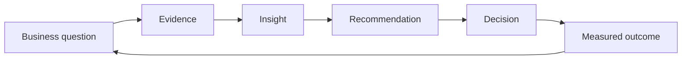

# Decision Storytelling: Complete Step-by-Step Guide

> Turning marketing and customer analytics into clear, evidence-backed executive decisions.

Decision storytelling is not decorating a dashboard or presenting every analytical result. It is the structured practice of connecting a business question to reliable evidence, a defensible insight, a recommended action, and a measurable outcome.

## Step 1 — Define the decision

**Technique:** decision-first framing.

1. Name the decision-maker.
2. State the exact decision and deadline.
3. Identify the available choices.
4. Define success and constraints.
5. Separate the decision from the broad topic.

**Example:** “Should marketing leadership reallocate next quarter’s paid-media budget?” is actionable; “How is marketing performing?” is not.

**Deliverable:** a one-sentence decision statement.

## Step 2 — Understand the audience

**Technique:** audience and information-needs analysis.

| Audience | Primary concern | Useful evidence | Best output |
|---|---|---|---|
| Executive leadership | Growth, risk, return | Trend, financial impact, confidence | One-page narrative |
| Marketing leadership | Budget allocation | CAC, ROAS, quality, incrementality | Decision brief |
| Campaign teams | Optimization | Creative, audience, funnel signals | Prioritized test backlog |
| Analytics teams | Validity | Definitions, assumptions, methods | Technical appendix |

Adapt depth and language without changing the underlying facts.

## Step 3 — Build the story spine

**Technique:** situation–complication–question–answer.

1. **Situation:** establish the relevant context.
2. **Complication:** explain what changed or why action is needed.
3. **Question:** state the decision that must be made.
4. **Answer:** lead with the recommended action.

This prevents a presentation from becoming a chronological tour through the analysis.

## Step 4 — Define governed metrics

**Technique:** metric hierarchy and denominator control.

| Layer | Example KPIs |
|---|---|
| Awareness | Reach, impressions, branded demand |
| Engagement | CTR, engagement rate, landing-page depth |
| Conversion | Inquiries, applications, conversion rate, CAC |
| Value | Revenue, ROAS, LTV, incremental lift |

For every KPI, document its formula, grain, population, source, owner, refresh timing, and known limitations. Reconcile GA4, CRM, paid-media, and finance definitions before presenting conclusions.

## Step 5 — Establish the baseline and comparison

**Technique:** context through benchmarks.

Use the comparison that matches the decision:

- Current period versus prior period
- Actual versus target
- Segment versus portfolio average
- Test versus control
- Forecast versus actual
- Incremental outcome versus attributed outcome

Avoid presenting a number without a meaningful reference point.

## Step 6 — Select only decision-relevant evidence

**Technique:** evidence filtering.

Keep an analytical result only when it changes one of these:

- The recommended action
- The expected impact
- Confidence in the recommendation
- A material risk
- The measurement plan

Place supporting diagnostics in an appendix instead of the main narrative.

## Step 7 — Diagnose the driver, not only the symptom

**Technique:** decomposition and segmentation.

Break aggregate movement into:

- Volume and rate effects
- Mix shift and within-segment performance
- Funnel-stage losses
- Channel, campaign, geography, device, product, and cohort effects
- Short-term conversion and longer-term customer value

Always test for Simpson’s paradox before treating an aggregate trend as universal.

## Step 8 — Distinguish observation from causation

**Technique:** evidence-strength labeling.

| Statement type | Appropriate language |
|---|---|
| Descriptive | “Conversion was lower in the paid-social cohort.” |
| Associational | “Lower engagement was associated with lower conversion.” |
| Predictive | “The model identifies customers at elevated churn risk.” |
| Causal | “The randomized test estimates the campaign caused a 4% lift.” |

Attribution reports and observational correlations do not establish incrementality.

## Step 9 — Quantify magnitude and uncertainty

**Technique:** effect-size communication.

Report:

- Absolute and relative change
- Revenue, cost, or customer impact
- Confidence interval or plausible range
- Sample size
- Materiality threshold
- Sensitivity to assumptions

A statistically significant result can still be too small to matter commercially.

## Step 10 — Design charts around the message

**Technique:** message-first visualization.

1. Use a takeaway title instead of a topic title.
2. Highlight the decision-relevant series.
3. Remove decorative clutter.
4. Label important values directly.
5. Use consistent units, denominators, and time scales.
6. Annotate interventions, tracking changes, and anomalies.
7. Make uncertainty visible.

Choose bars for comparison, lines for time, slopes for change, funnels for stage loss, scatterplots for relationships, and small multiples for comparable segments.

## Step 11 — Write the insight

**Technique:** fact–meaning–implication.

- **Fact:** what the evidence shows.
- **Meaning:** why the pattern exists or matters.
- **Implication:** what the decision-maker should do differently.

Example: “Paid-social spend rose 30%, but qualified outcomes increased only 5%. The marginal audience appears lower intent. Cap expansion and test narrower targeting before restoring growth spend.”

## Step 12 — Make the recommendation executable

**Technique:** action specification.

A strong recommendation states:

- What action to take
- Who owns it
- When it starts
- Required budget or resources
- Expected impact
- Key assumptions
- Guardrail metrics
- Stop, continue, or scale criteria

Offer alternatives when the decision involves a genuine trade-off.

## Step 13 — Surface risks and counterevidence

**Technique:** pre-mortem and disconfirmation.

Ask:

- What evidence would reverse the recommendation?
- Could tracking or denominator drift explain the result?
- Is seasonality confounded with an intervention?
- Are we excluding failed or unobserved customers?
- Does the aggregate hide a harmed segment?
- Will optimizing the short-term KPI damage lifetime value?

Present the principal risk alongside the recommendation.

## Step 14 — Structure the executive output

**Technique:** progressive disclosure.

A concise decision brief should follow this order:

1. Decision required
2. Recommended action
3. Expected business impact
4. Two or three supporting insights
5. Principal risk and confidence
6. Measurement and next step
7. Technical appendix

The first page should be sufficient for the decision; the appendix should be sufficient for scrutiny.

## Step 15 — Measure whether the story worked

**Technique:** decision and outcome instrumentation.

Track:

- Decision adoption
- Time from evidence to decision
- Reporting effort
- Experiment completion
- Forecast accuracy
- Incremental KPI movement
- Whether guardrails were protected

Communication is successful when it improves decision quality and action—not when slides merely receive positive feedback.

## Worked executive case

**Situation:** Paid-media volume is increasing, but blended acquisition efficiency is weakening.

**Decision:** Should leadership cut total spend or change the channel and audience mix?

**Analysis path:**

1. Reconcile platform spend with GA4 sessions and CRM outcomes.
2. Separate volume growth from lead-quality and conversion-rate changes.
3. Compare source, campaign, geography, and funnel-stage cohorts.
4. Quantify immediate conversion and longer-term value.
5. Test whether tracking, seasonality, or mix shift explains the change.
6. Present one action, two supporting insights, and the principal risk.

| Finding pattern | Business inference | Recommended validation |
|---|---|---|
| Spend grows faster than qualified outcomes | Marginal efficiency may be declining | Geo holdout or capped-budget test |
| CTR rises while downstream CVR falls | Creative may attract low-intent traffic | Message-to-landing-page experiment |
| Platform and CRM conversions disagree | Attribution may overstate impact | Identity and event reconciliation |

**Example recommendation:** Maintain the total budget, move 15% from low-quality paid-social audiences into higher-value search cohorts, and validate incrementality with a four-week geo holdout. Stop the reallocation if qualified volume declines more than the agreed guardrail.

## Common storytelling failures

- Starting with methodology instead of the decision
- Showing every chart produced during analysis
- Using a dashboard as a substitute for a recommendation
- Reporting relative lift without the absolute baseline
- Treating platform attribution as causal impact
- Hiding uncertainty, assumptions, or contradictory evidence
- Optimizing a proxy metric while ignoring downstream value
- Ending with “more analysis is needed” without defining the next decision

## Reusable quality checklist

### Decision

- [ ] Decision-maker, action, deadline, and alternatives are explicit.
- [ ] Success criteria and constraints are defined.

### Evidence

- [ ] Metrics have stable definitions and denominators.
- [ ] Data sources reconcile or discrepancies are disclosed.
- [ ] Comparisons, segments, and time windows match the decision.
- [ ] Observation, prediction, and causation are clearly separated.
- [ ] Magnitude and uncertainty are quantified.

### Communication

- [ ] The recommendation appears before supporting detail.
- [ ] Each chart has a takeaway title.
- [ ] The narrative includes fact, meaning, and implication.
- [ ] Risks and counterevidence are visible.
- [ ] An appendix preserves technical depth.

### Action

- [ ] Owner, timing, resources, and next step are specified.
- [ ] Guardrails and scale/stop rules are defined.
- [ ] Decision adoption and business outcomes will be measured.

## Tools

Python · Pandas · SQL · BigQuery · Tableau/Plotly · Streamlit · GitHub.

Relevant professional evidence includes executive analytics supporting roughly **$20M in annual marketing investment** and automated reporting workflows that reduced manual effort by **60%**. These are experience-level results, not outputs generated by this blueprint repository.

> Use governed first-party data and experimental evidence before making live investment decisions.
