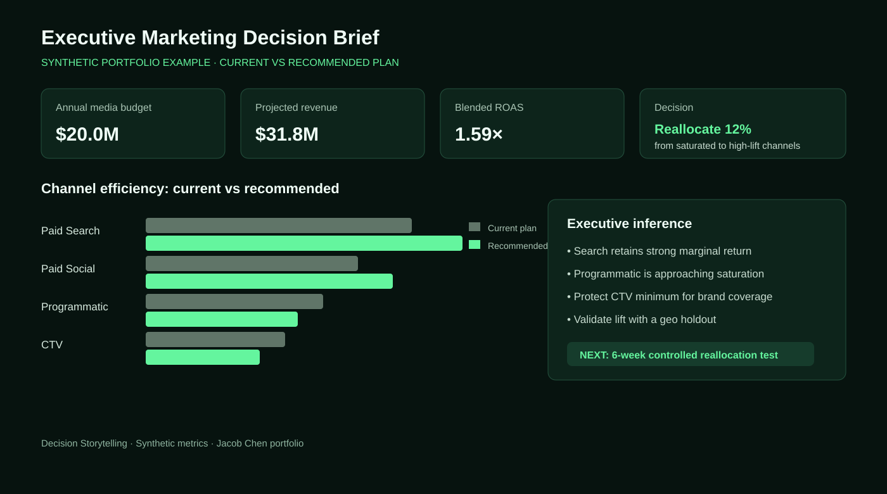

# Decision Storytelling

> Turning marketing and customer analytics into clear executive decisions.

## The story arc

| Audience | Decision | Evidence | Output |
|---|---|---|---|
| Marketing leadership | Where to invest next | Funnel, channel, and cohort trends | Executive narrative and action plan |
| Campaign teams | What to optimize | KPI movement and customer behavior | Prioritized test backlog |

## What this project demonstrates

- Framing analysis around a decision rather than a dashboard.
- Translating GA4, CRM, paid-media, and customer-funnel metrics into a concise business narrative.
- Designing charts that make trade-offs visible: growth versus efficiency, volume versus quality, and short-term versus long-term impact.

## Measurement approach

| Layer | Example KPIs |
|---|---|
| Awareness | Reach, impressions, branded demand |
| Engagement | CTR, engagement rate, landing-page depth |
| Conversion | Inquiries, applications, conversion rate, CAC |
| Value | Revenue, ROAS, LTV, incremental lift |

## Software

Python · SQL · BigQuery · Tableau/Plotly · Streamlit · GitHub. Production extensions include automated reporting, data-quality checks, and versioned executive reporting.

> Portfolio blueprint: use governed first-party data and experiment evidence before making live investment decisions.

## Example executive case

**Situation:** Paid-media volume is increasing, but blended acquisition efficiency is weakening and leadership needs to decide whether to cut spend or change the mix.

**Analysis path:**

1. Reconcile platform spend with GA4 sessions and CRM outcomes.
2. Separate volume growth from lead-quality and conversion-rate changes.
3. Compare source, campaign, geography, and funnel-stage cohorts.
4. Quantify the trade-off between immediate conversions and longer-term demand creation.
5. Present one recommended action, two supporting insights, and the principal risk.

| Finding pattern | Business inference | Recommended validation |
|---|---|---|
| Spend grows faster than qualified outcomes | Marginal efficiency may be declining | Geo holdout or capped-budget test |
| CTR rises while downstream CVR falls | Creative may attract low-intent traffic | Message-to-landing-page experiment |
| Platform and CRM conversions disagree | Attribution or tracking may be overstating impact | Identity and event reconciliation |

## Success criteria

Measure decision adoption, time-to-insight, reporting effort, experiment completion, and downstream KPI movement. Relevant professional evidence includes executive analytics supporting roughly **$20M in annual marketing investment** and automated reporting workflows that reduced manual effort by **60%**; these are experience-level results, not outputs generated by this blueprint repository.

## Trade-offs and next steps

- A simple narrative improves clarity but can hide heterogeneity; preserve drill-down evidence.
- A dashboard increases access but does not create a decision process by itself.
- Platform ROAS is useful operationally, but budget decisions should incorporate CRM outcomes and incrementality.
- Next step: add a reproducible notebook, executive dashboard screenshots, metric dictionary, and sample recommendation memo.
