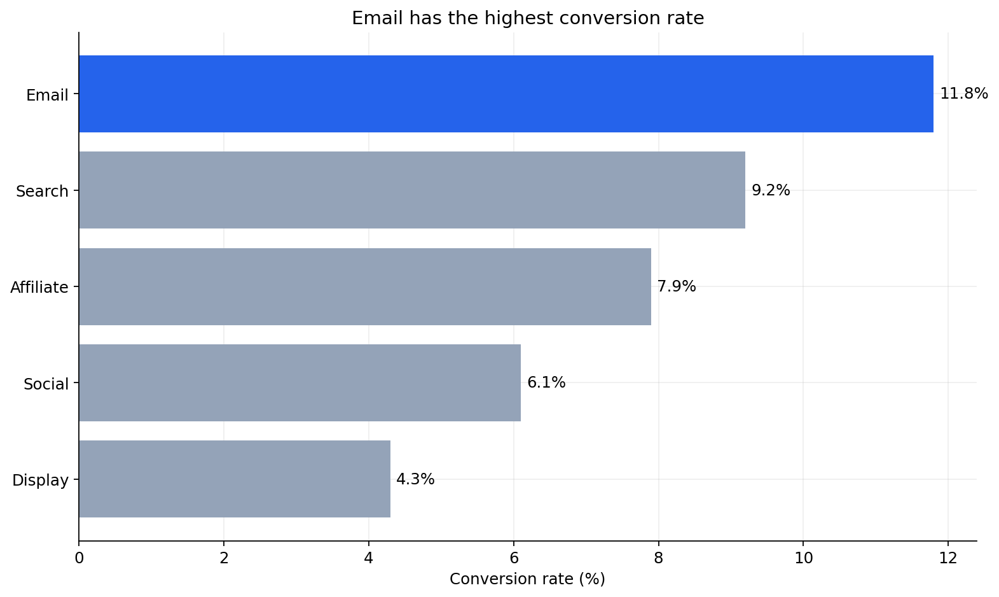
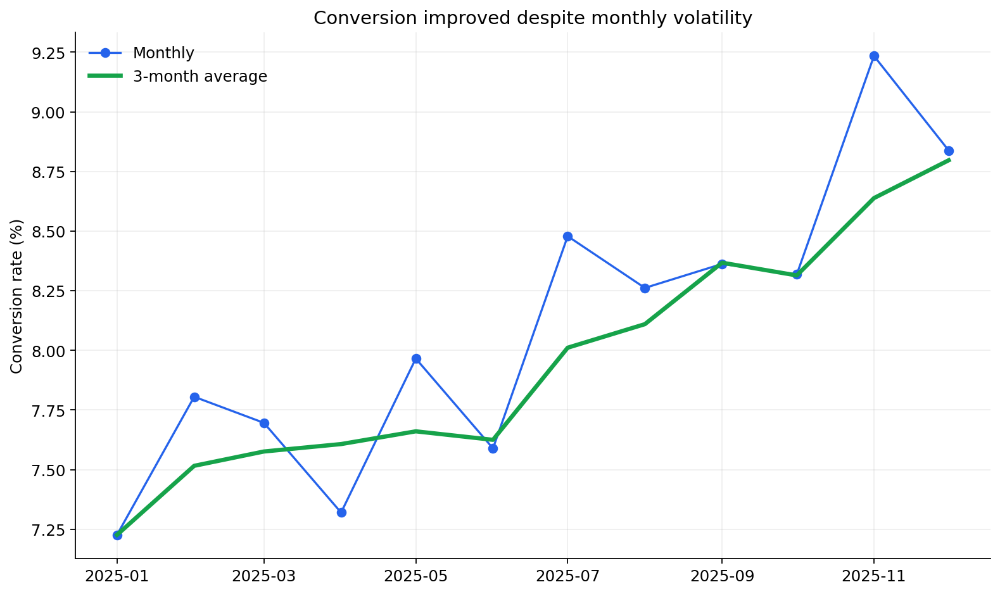
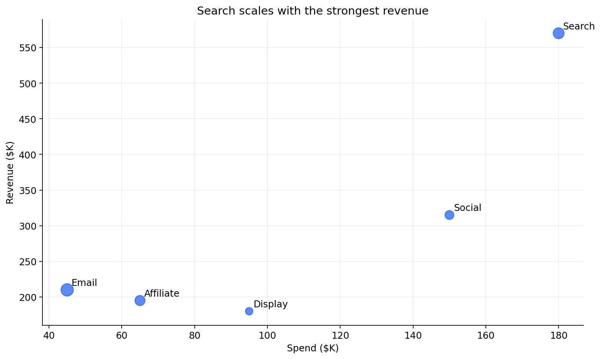
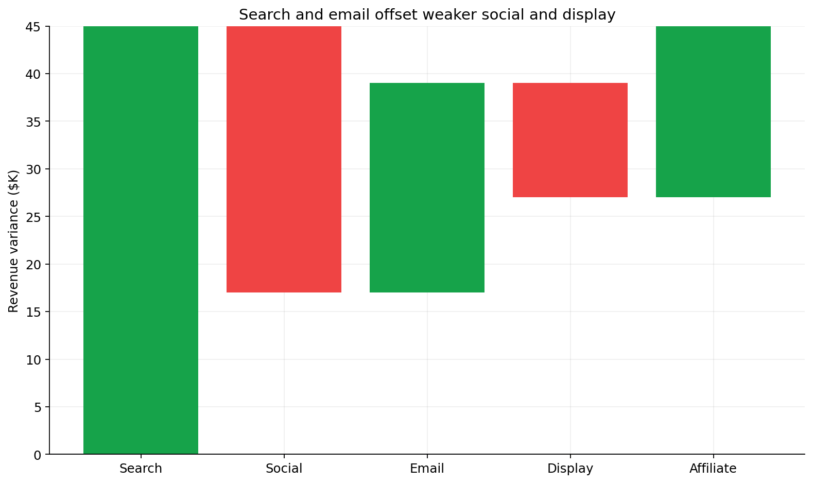
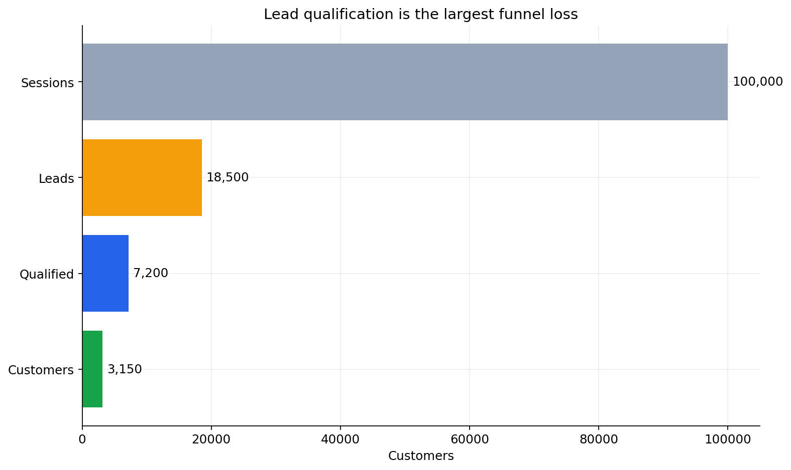
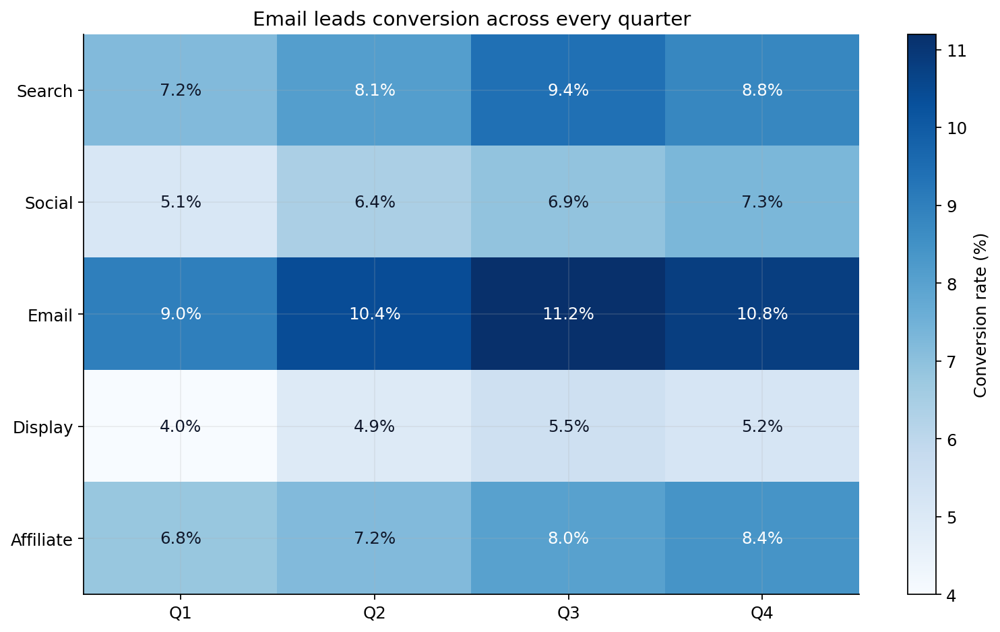
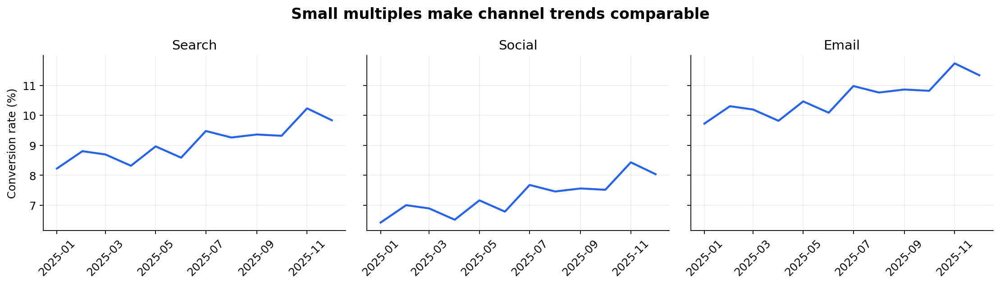
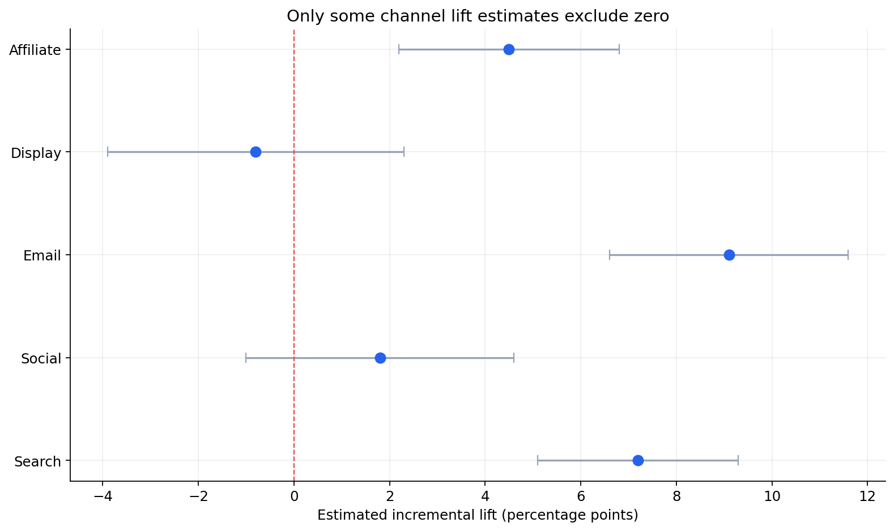

# Python Data Visualization Techniques

This module demonstrates eight decision-focused visualization patterns using a deterministic synthetic marketing dataset.

## Run the examples

```bash
pip install -r requirements.txt
python visualization_techniques.py
pytest -q
```

Generated charts are written to `outputs/`.

## Techniques included

| Technique | Best use | Example |
|---|---|---|
| Ranked bar chart | Compare categories and emphasize a winner | Conversion rate by channel |
| Trend plus rolling baseline | Separate signal from short-term noise | Monthly conversion |
| Bubble scatterplot | Show relationships plus a third magnitude | Spend, revenue, and conversion |
| Waterfall chart | Explain contributors to a total change | Revenue variance |
| Funnel chart | Find stage loss | Sessions to customers |
| Heatmap | Compare two categorical dimensions | Channel by quarter |
| Small multiples | Compare trends on consistent axes | Channel conversion trends |
| Confidence intervals | Show effect magnitude and uncertainty | Incremental channel lift |

## Gallery
















